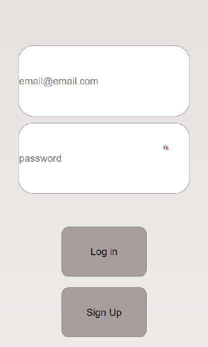
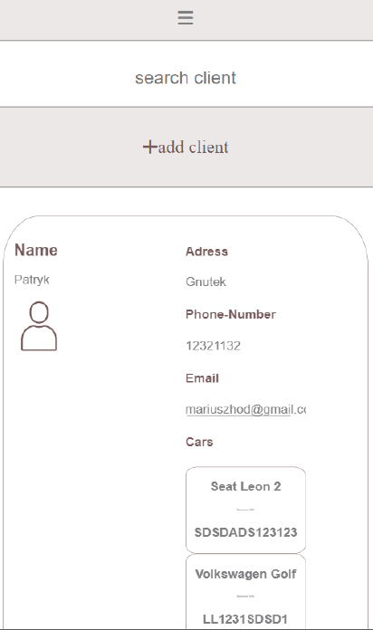
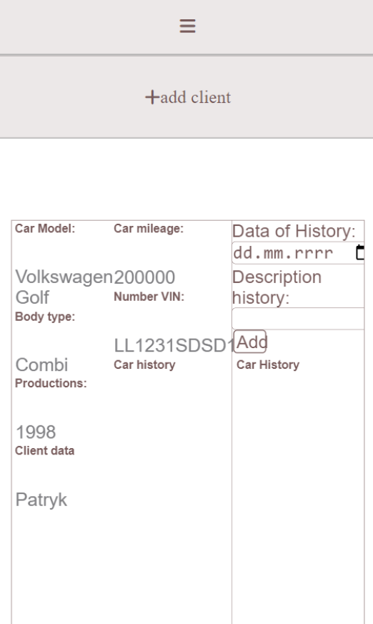
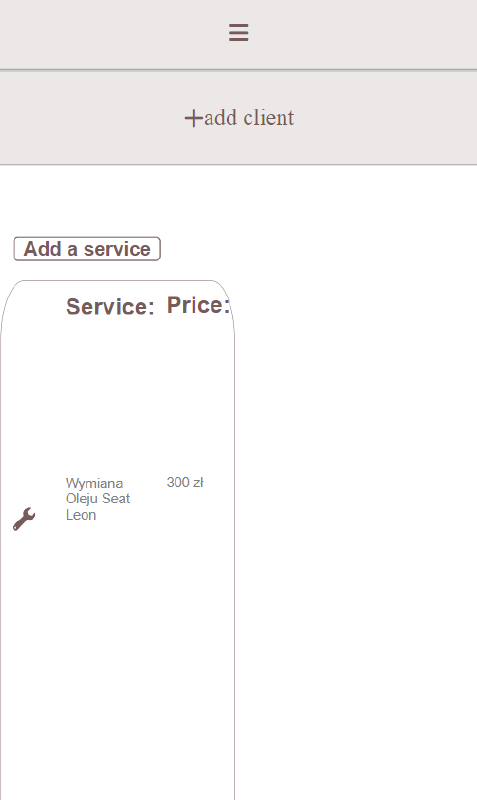
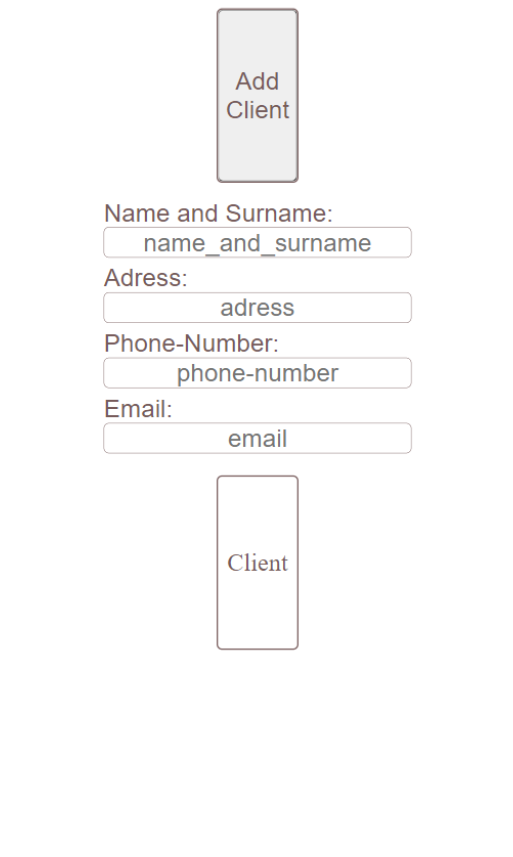

# Car Service

Car Service is an application for managing your car repair shop.

## Table of Contents

1. [Description](#description)
2. [Technologies](#technologies)
3. [Installation](#installation)
4. [Usage](#usage)
5. [Examples](#examples)
6. [Contributing](#contributing)
7. [Authors](#authors)
8. [License](#license)

## Description

This application is created for managing car repair shop.
The application allows you to add customers, their cars and the car repair history of these cars.
Additionally, the application allows you to add repair and meeting dates.
We can enter our own rates for a given service.

## Technologies
- Code
    - HTML 5
    - CSS 3
    - JavaScript
    - React
    - Java
    - Spring Boot
- Database
    - Postgresql
- Cointainer
    - Docker

## Installation

Step-by-step instructions on how to install the project locally.

## Usage
Login page 

 
Client page 

 
History page

 
Calendar page

 
Price List page

 
Add Client page

 
Login mobile page 

 
Client mobile page 

 
History mobile page

 
Calendar mobile page

 
Price List mobile page

 
Add Client mobile page

 
## Examples

Sample use cases of the project along with code snippets.

## Contributing

Information on how to contribute to the project, report bugs, suggest features, etc.

## Authors

Mariusz Hodana

## License

Information about the project's license.
